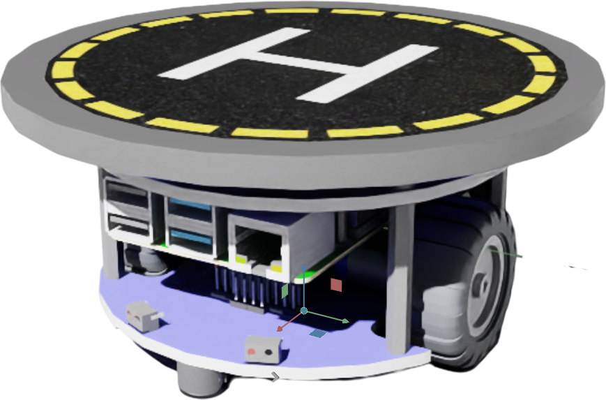
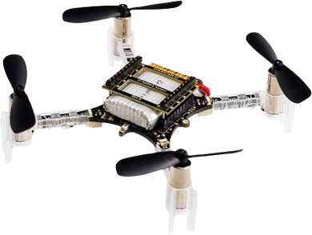
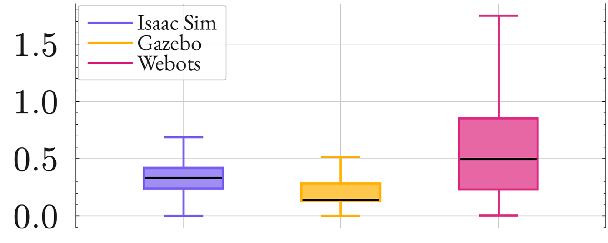
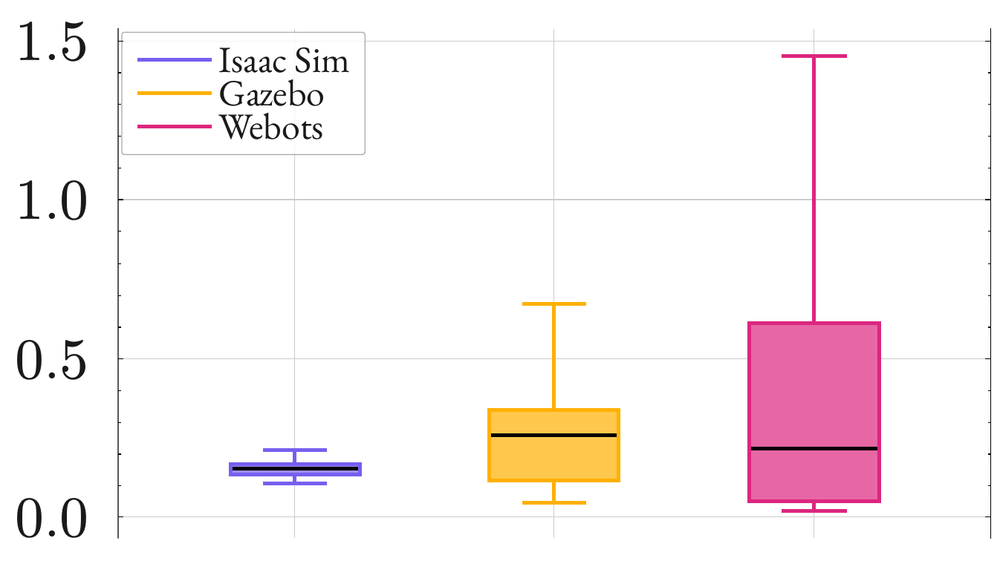

# PER2025-057: Autonomous Drone Landing on a Moving Platform

<p align=center>
    
    <br/>
    <a href="https://releases.ubuntu.com/noble/">
        
    </a>
    <a href="https://docs.ros.org/en/jazzy/index.html">
        
    </a><br />
    <span>Work carried out by <a href="https://github.com/komi-assimpah">Komi Jean-Paul Assimpah</a>, <a href="https://github.com/AlbanFALCOZ">Alban Falcoz</a>, <a href="https://github.com/06Games">Evan Galli</a> and <a href="https://github.com/Alexandre-Gripari">Gripari Alexandre</a>
    <br/>as part of the <b>Study and Research Project</b>.</span>
</p>

This project aims to implement a collaborative system allowing a Crazyflie 2.1+ nano-drone to autonomously land on a
moving Waveshare AlphaBot2 platform.

Developed under ROS 2 Jazzy, the system uses Deep Reinforcement Learning to coordinate the drone's trajectory based on
real-time sensor fusion (Flow Deck v2 and camera tracking).

The guidance strategy is first trained in NVIDIA IsaacSim (coupled with IsaacLab).
The models are subsequently validated in Gazebo to study the transferability between different simulation engines (
Sim2Sim).

The system can then be deployed on physical hardware to analyze and bridge the reality gap (Sim2Real).

## Installation

1. Clone this repository using :
    ```
    git clone https://github.com/Other-Project/SI5-PER.git --recursive
    ```

2. Install ROS Jazzy, Gazebo Harmonic and Webots.  
   A helper script is available for Ubuntu 24.04: `utils/install.sh`  
   Another helper script is available to deploy on the Alphabot2 with Ubuntu Server 24.04: `utils/install_deployed.sh`

3. [Install uv](https://docs.astral.sh/uv/#installation) to manage Python dependencies

## Usage

### Building

| Command        | Description                               |
|----------------|-------------------------------------------|
| `make install` | Install all ROS dependencies              |
| `make build`   | Build all ROS packages                    | 
| `make package` | Helper script to create a new ROS package |

### Simulation

| Command           | Description                                      |
|-------------------|--------------------------------------------------|
| `make isaac`      | IsaacLab/IsaacSim helper script to train or play |
| `make sim`        | Starts the Gazebo simulation                     |
| `make sim_webots` | Starts the Webots simulation                     |

If you're using Isaac on Windows, you should use these commands instead of `make isaac`:

```
uv sync --directory src/IsaacLab
./src/IsaacLab/.venv/Scripts/activate
python ./utils/run_helper.py
```

### Teleop

| Command                 | Description                              |
|-------------------------|------------------------------------------|
| `make teleop_drone`     | Keyboard control for the drone           |
| `make teleop_bot`       | Keyboard control for the AlphaBot2       |
| `make teleop_drone_joy` | Gamepad (Xbox) control for the drone     |
| `make teleop_bot_joy`   | Gamepad (Xbox) control for the AlphaBot2 |

### Cleanup

| Command          | Description                              |
|------------------|------------------------------------------|
| `make clean`     | Deletes ROS build artifacts (`.out/`)    |
| `make mr_proper` | Also deletes Python virtual environments |

## Documentation (in French)

* [Initial subject](docs/PER2025-057.pdf)
* [Description of Work](docs/DoW.pdf)
* [State of the Art](docs/StateOfArt.pdf)
* [Poster](docs/Poster.pdf)

> [!Warning]
> TODO: Video

---

## Project Overview

Automated drone missions, such as landing on moving platforms, are highly non-trivial. They require precise control,
rapid adaptation to dynamic environments, and robust tracking of a moving target. Traditional control methods often
struggle to generalize when faced with these complex, real-world variables.

The objective of this project is to achieve autonomous drone landing on a mobile platform using Deep Reinforcement
Learning (DRL).

To keep the project focused and scientifically rigorous, we have defined the following boundaries:

- We strictly explore Deep Reinforcement Learning (DRL) solutions. Specifically, we utilize the PPO algorithm from the
  `rsl_rl` library within Isaac Lab.
- The agent relies on odometry for state estimation (providing X, Y, Z coordinates). Rather than computing low-level
  motor thrusts, the policy outputs high-level velocity commands.
- The training environment assumes a clear line of sight with no obstacles between the drone and the platform. However,
  we do explicitly account for complex aerodynamics, specifically modeling the ground effect as the drone approaches the
  landing surface.
- For this scope, the mobile platform's movement is restricted to traveling in a straight line at a constant speed.
- We do not claim to entirely solve the sim2real gap. Instead, our pipeline is designed to help us better understand and
  quantify it. By passing through a Sim2Sim validation step (Isaac Lab to Gazebo), we can isolate and measure
  discrepancies before our Sim2Real physical deployment.

This repository is designed for robotics researchers, UAV engineers, and DRL practitioners looking for a structured,
reproducible pipeline that bridges the gap between high-speed simulation (Isaac Lab) and real-world drone operations.

## Available Solutions and Selected Approach

### Simulation-based approach

While training a Deep RL agent directly on a physical drone is technically possible, this approach is not recommended
and might be sub-optimal. Real-world training can be time-consuming, risks damaging the hardware during trial-and-error
phases, and often fails to converge to a stable policy.

To overcome these physical limitations, simulation-based approaches offer a highly effective alternative. The use of
physical simulators creates a safe and cost-effective environment in which agents can fail millions of times without
risking damage to expensive equipment or compromising safety. In addition, simulation environments can be significantly
parallelized, allowing thousands of instances to run simultaneously in physics engines [^10]. This capability compresses
weeks of real flight experience into a few minutes of computation time, greatly accelerating the learning process.

### Control Strategy

To successfully land a nano-drone on a moving platform, the control strategy must handle dynamic environments, sensor
noise, and complex aerodynamic interactions (like the ground effect).

#### Why not classical methods?

Traditional control algorithms, such as PID or MPC, rely heavily on precise mathematical models and manual tuning. While
well-understood, they struggle to handle unmodeled non-linear dynamics and often need too much computing power to run in
real-time on constrained edge devices [^4].

#### The Chosen Solution: Deep Reinforcement Learning (DRL)

To bypass the limitations of mathematical modeling, we implemented a Deep Reinforcement Learning (DRL) architecture. In
this setup, an artificial agent learns the optimal landing policy through numerous trial-and-error interactions inside a
massively parallelized physics simulation. Rather than explicitly programming the flight dynamics, we define the landing
objective via a reward function, and the neural network policy continuously updates its weights to maximize its success
rate.

**Model Observations (Inputs)**
The agent relies on a 13-dimensional continuous observation space to maintain real-time awareness of both its own state
and the moving target:

| Feature                    | Dimensions     | Description                                                                                     |
|:---------------------------|:---------------|:------------------------------------------------------------------------------------------------|
| **Drone Linear Velocity**  | 3 (X, Y, Z)    | The current speed and directional movement of the nano-drone.                                   |
| **Drone Rotation**         | 4 (Quaternion) | The spatial orientation of the drone in 3D space.                                               |
| **Relative Distance**      | 3 (X, Y, Z)    | The positional offset between the drone and the moving landing platform.                        |
| **Target Linear Velocity** | 3 (X, Y, Z)    | The speed and trajectory of the platform, necessary for predictive tracking and landing timing. |

**Model Actions (Outputs)**
Based on the observations, the trained policy dictates the drone's movement by outputting a 4-dimensional action vector:

| Command              | Dimensions  | Description                                                                                            |
|:---------------------|:------------|:-------------------------------------------------------------------------------------------------------|
| **Linear Velocity**  | 3 (X, Y, Z) | Controls the horizontal alignment (X, Y) and the vertical descent rate (Z) toward the moving platform. |
| **Angular Velocity** | 1 (Yaw)     | The rotational speed used to align the drone's heading with the landing platform’s trajectory.         |

### Curriculum learning

To further optimize the model, we implemented Curriculum learning into the DRL training process. This approach
structures training according to increasing levels of complexity and moves the model from elementary examples to a
comprehensive set of tasks [^8].

By gradually increasing the difficulty of the environment and the landing task during training, it improves the model's
convergence rate and robustness, reducing the total number of iterations needed to obtain an optimal
solution [^5], [^7], [^9]. In some cases, decomposing tasks effectively can yield up to a 70% reduction in training
time [^6].

## Positioning Relative to the State of the Art

Our approach builds upon proven methodologies in DRL for aerial robotics, while introducing an intermediate validation
architecture to mitigate the "Reality Gap".

### Alignment with Established Practices

In continuity with existing literature, our solution uses the Proximal Policy Optimization (PPO) algorithm to train the
autonomous landing agent. As highlighted in recent papers, PPO is often considered the preferred algorithm for
controlling multirotor UAVs [^1], [^2], [^4]. It offers an optimal balance between implementation simplicity and
training robustness [^1].

Unlike Off-Policy algorithms such as DDPG or TD3, PPO uses a clipped objective function that restricts drastic policy
updates [^1]. This mechanism prevents numerical instabilities and ensures safer and more reliable convergence, which is
essential for maximizing the success rate during physical deployment.

### Dual-Simulator Validation (Sim-to-Sim)

While standard approaches tend to rely heavily on techniques such as domain randomization to attempt direct policy
transfer from a single training simulator to the real world [^14], [^15], our solution stands out by integrating a
Sim-to-Sim validation phase [^10].

To overcome the limitations present in standard simulation, our workflow is split into two distinct phases:

* Training Phase (via Isaac Sim): Initial policy learning takes place in a highly parallelizable physics engine. This
  approach maximizes computational efficiency and sample generation, allowing the agent to quickly learn critical tasks
  such as navigation and landing.
* Validation Phase (via Gazebo): Before physical deployment, the trained policy is transferred to a second simulator for
  evaluation within a complete ROS environment. This phase serves as a critical check for software integration, ensuring
  that the RL policy correctly interfaces with the ROS node architecture and the drone's overall control stack before
  any hardware deployment.

By validating the algorithm's system integration in this secondary digital environment before touching the hardware, we
reduce the risks associated with software architecture deployment, ensuring a safer transition to the physical
nano-drone.

## Conducted Work & Task Distribution

The AI/Data (IA-ID) team primarily focused on model training and the broader IsaacLab integration, while the IoT-CPS
team concentrated on establishing a ROS-Gazebo transfer environment. Although these components were developed somewhat
independently, the strong coupling required for sim-to-sim transfer necessitated close and continuous collaboration
between both teams.

### IsaacLab

#### Architecture and Integration

- Base Framework: The environment was heavily developed on top of the base quadcopter repository.
- ROS-Isaac Bridge: A custom ROS bridge was successfully developed within two weeks. This enables communication between
  the IsaacLab and Gazebo simulations during the training phase.

#### Curriculum Learning and Environment Design

- Manual Curriculum Learning: Due to the absence of a manager-based architecture, Curriculum Learning had to be
  implemented manually.
- Dynamic Landing Platform: A moving platform was introduced into the environment, and the quadcopter's goal position
  was dynamically defined to track this moving target.
- Hyperparameter Tuning: The increased complexity of the dynamic landing task necessitated a larger model. Furthermore,
  the entropy coefficient was increased to encourage the exploration of complex behaviors, most notably teaching the
  model the non-intuitive action of cutting the motors upon landing.
- Reward Shaping: The reward and penalty functions were significantly reworked. New constraints were added to
  specifically address the landing mechanics, which operated in tandem with the baseline objectives of minimizing
  distance and velocities.

#### Action Space Adaptation

- Output Standardization: To ensure cross-simulation compatibility with the Gazebo environment, the model's output
  action space was modified to a higher-level command structure.
- Physics Engine Conversion: Because the IsaacLab physics engine natively accepts only thrust and moments commands, a
  conversion layer was implemented. This layer translates the model's high-level outputs back into precise moments and
  thrusts before applying them to the simulated quadcopter.

### Ros & Gazebo

#### Sim2Sim bridge

The Sim2Sim bridge was implemented to connect Isaac Lab and Gazebo via a unified ROS 2 communication layer. Observations
generated in Isaac are transmitted to Gazebo via ROS topics, where the PPO policy calculates high-level velocity
commands that are applied to the drone model. The resulting state of the drone (position and orientation) is sent back
to Isaac, ensuring synchronized evaluation between the simulators. This bidirectional exchange allows for a direct
comparison of flight dynamics between the two physics engines, while maintaining the same control policy. As a result,
this bridge establishes a Sim2Sim verification framework that can be validated and controlled before deployment in
real-world conditions.

#### Inference node

The ROS 2 inference node serves as the real-time decision engine by executing the trained PPO policy via an ONNX
runtime. Synchronized with the Gazebo simulation, it continuously evaluates state observations to compute and publish
high-level velocity commands (`/crazyflie/input_cmd_vel`) to guide the drone toward a safe landing on the moving
platform.

#### Controller

Due to the complexity of multirotor flight dynamics, a dedicated controller validates and corrects the high-level
commands before they are transmitted to the drone. It actively corrects inputs by clamping extreme values and ensuring
that the (x,y,z) velocity components remain kinematically coherent. To manage flight stability effectively, the
controller dynamically adapts its behavior across three distinct flight phases:

- **Takeoff:** Triggered by a positive z-velocity and an initial altitude threshold, this phase safely guides the drone
  through its initial ascent.
- **Cruising:** Focuses on maintaining a constant altitude and stabilizing the drone's attitude while preventing
  instability such as flipping or sudden altitude drops.
- **Landing:** Initiated by negative z-velocities and a lower altitude threshold, this phase carefully regulates the
  descent rate to mitigate ground effect and ensure a smooth landing.

## Results & Future Work

### Sim2Sim Validation and Performance

The trained PPO policy demonstrated excellent stability within the native Isaac Lab environment. To evaluate its
robustness before physical deployment, we conducted a Sim2Sim validation, transferring the policy to two other
simulators: Gazebo and Webots. We analyzed three main indicators: altitude profile, travel speed, and 3D trajectories.

<p align="center">
    <br/>
    <em>Speed distribution between simulators</em>
</p>

<p align="center">
    <br/>
    <em>Altitude distribution among simulators</em>
</p>

### Simulator Analysis and 3D Trajectories

<p align="center">
    <br/>
    <em>Drone trajectory between simulators</em>
</p>

### Results analysis

The trained policy demonstrates excellent performance and accuracy within the native IsaacLab environment. The
implementation of the three-step learning process stabilized training, enabling the policy to reliably track and land on
a moving target. While manual conversion from linear velocities to moments and thrust occasionally introduces minor
flight instability and slight trajectory deviations, the drone consistently reaches its objective.

However, exporting the model to Gazebo revealed a noticeable drop in performance. This sim-to-sim discrepancy persists
despite extensive efforts to align the IsaacLab model and environment parameters closely with Gazebo's physics. The
drone exhibits slightly different flight dynamics within Gazebo, and a major contributing factor to the transfer
difficulty is the inherent instability of the Gazebo drone model itself.

To further evaluate the model's adaptability, the policy was also tested within the Webots simulator. Unfortunately, the
results in this environment were not very conclusive. This highlights the complexity of transfer between simulators and
shows that this strategy is highly dependent on the accuracy of the underlying physics engine.

## Remaining work

- Refactor the codebase to a manager-based system. This architectural shift will facilitate the implementation of domain
  randomization and curriculum learning.
- Implement an LSTM (Long Short-Term Memory) network. This will enable the policy to capture temporal dependencies and
  memory, improving the drone's overall decision-making and stability during continuous flight sequences.
- Deploy the trained policy onto the physical drone.

## Bibliography

[^1]: J. Amendola, L. R. Cenkeramaddi, and A. Jha, "Drone Landing and Reinforcement Learning: State-of-Art, Challenges
and Opportunities," IEEE Open Journal of Intelligent Transportation Systems, vol. 5, pp. 520-539, 2024.
[^2]: A. T. Azar et al., "Drone Deep Reinforcement Learning: A Review," Electronics, vol. 10, no. 9, p. 999, 2021.
[^4]: S. Sönmez, M. J. Rutherford, and K. P. Valavanis, "A Survey of Offline- and Online-Learning-Based Algorithms for
Multirotor Uavs," Drones, vol. 8, no. 4, 2024.
[^5]: F. Liu, T. Zhang, C. Zhang, L. Liu, L. Wang, and B. Liu, "A Review of the Evaluation System for Curriculum
Learning," Electronics, vol. 12, no. 7, 2023.
[^6]: J. Eßer, N. Bach, C. Jestel, O. Urbann, and S. Kerner, "Guided Reinforcement Learning: A Review and Evaluation for
Efficient and Effective Real-World Robotics [Survey]," IEEE Robotics & Automation Magazine, vol. 30, no. 2, pp. 67-85, 2023.
[^7]: S. Narvekar et al., "Curriculum Learning for Reinforcement Learning Domains: A Framework and Survey," Journal of
Machine Learning Research, vol. 21, no. 181, pp. 1-50, 2020.
[^8]: X. Wang, Y. Chen, and W. Zhu, "A Survey on Curriculum Learning," IEEE Transactions on Pattern Analysis and Machine
Intelligence, vol. 44, no. 9, pp. 4555-4576, 2022.
[^9]: R. Portelas, C. Colas, L. Weng, K. Hofmann, and P.-Y. Oudeyer, "Automatic Curriculum Learning For Deep RL: A Short
Survey," 2020.
[^10]: D. Hanover et al., "Autonomous Drone Racing: A Survey," IEEE Transactions on Robotics, vol. 40, pp. 3044-3067, 2024.
[^14]: E. Salvato, G. Fenu, E. Medvet, and F. A. Pellegrino, "Crossing the Reality Gap: A Survey on Sim-to-Real
Transferability of Robot Controllers in Reinforcement Learning," IEEE Access, vol. 9, pp. 153171-153187, 2021.
[^15]: R. Polvara, M. Patacchiola, M. Hanheide, and G. Neumann, "Sim-to-Real Quadrotor Landing via Sequential Deep
Q-Networks and Domain Randomization," Robotics, vol. 9, no. 1, 2020.
