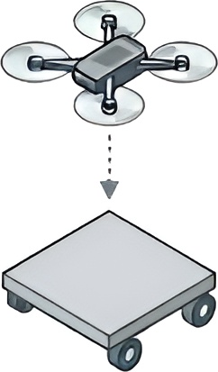
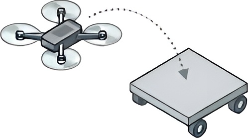
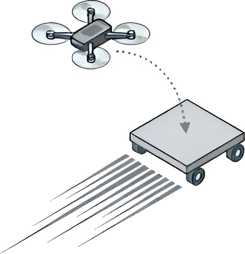
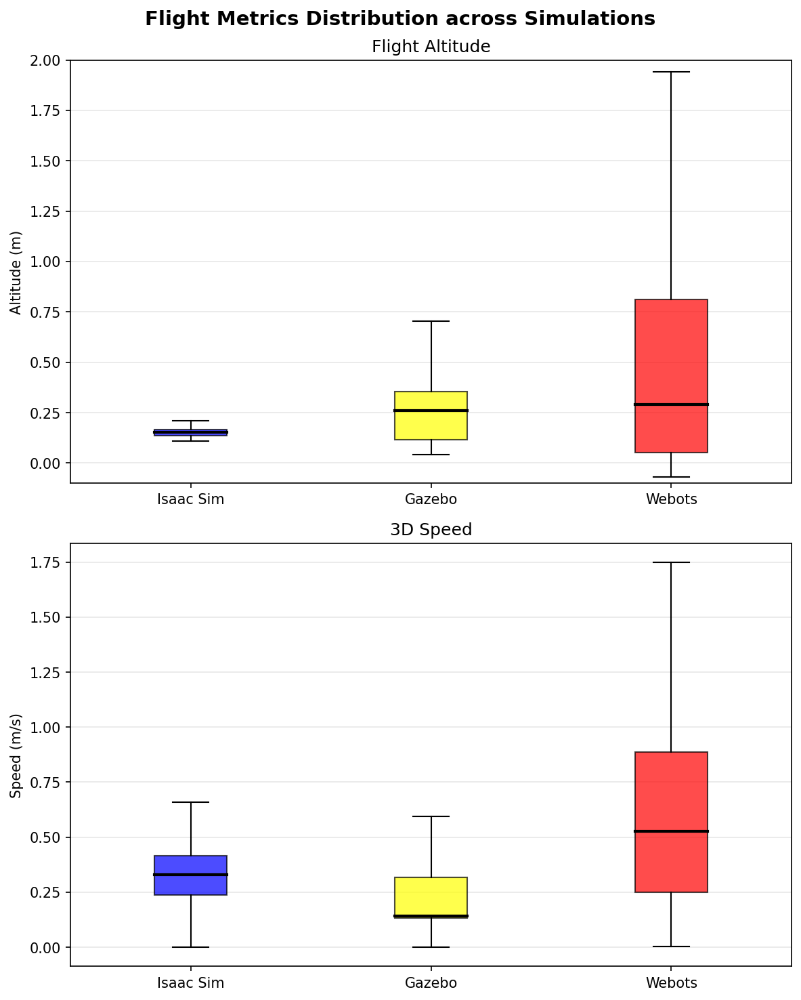
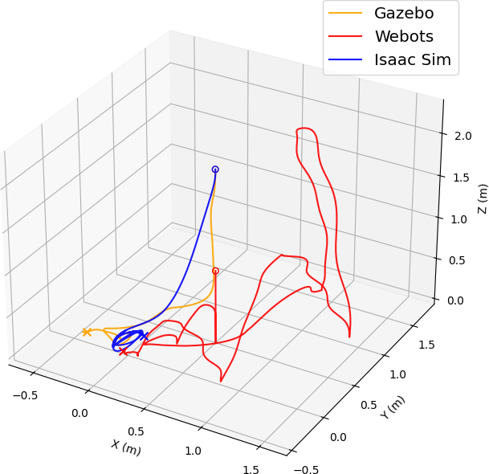

# PER2025-057 - Systèmes collaboratifs pour le contrôle d'atterrissage d'un nano-drone sur plateforme mobile

<p align=center>
    
    <br/>
    <a href="https://releases.ubuntu.com/noble/">
        
    </a>
    <a href="https://docs.ros.org/en/jazzy/index.html">
        
    </a><br />
    <span>Projet réalisé par <a href="https://github.com/komi-assimpah">Komi Jean Paul Assimpah</a> (IoT-CPS), <a href="https://github.com/AlbanFALCOZ">Alban Falcoz</a> (IA-ID), <a href="https://github.com/06Games">Evan Galli</a> (IoT-CPS) et <a href="https://github.com/Alexandre-Gripari">Alexandre Gripari</a> (IA-ID)
    <br/>Encadrant : <b>Gérald ROCHER</b> - Polytech Nice Sophia, Université Côte d'Azur - Octobre 2025 - Février 2026</span>
</p>

---

## 1. Présentation du sujet
### 1.1 Problématique

Ce projet vise à concevoir un système collaboratif permettant à un nano-drone de type Crazyflie 2.1+ d'atterrir de manière autonome sur une plateforme mobile de type Waveshare AlphaBot2.

L'atterrissage autonome de drones sur des plateformes mobiles représente un défi majeur en robotique et en intelligence artificielle. Ce problème combine plusieurs aspects complexes :

**Défis principaux :**
- **Perception** : La détection et le suivi en temps réel d'une cible en mouvement
- **Coordination** : La coordination des mouvements du drone pour compenser les déplacements de la plateforme
- **Aérodynamique** : gestion de l'effet de sol, Le flux d'air généré par le drone lorsqu'il vole très près d'une surface crée un effet qui modifie la portance et peut déséquilibrer l'appareil, particulièrement critique pour les nano-drones en raison de leur faible masse (29g)

- **Défis de contrôle :** La robustesse face aux perturbations environnementales
### 1.2 Contexte

Ce projet s'inscrit dans le domaine de la robotique collaborative et des systèmes multi-agents. Les applications potentielles incluent :

**Applications industrielles et logistiques :**
- La recharge automatique de drones en mission sur des véhicules mobiles
- Les opérations de livraison sur des plateformes en mouvement
- La maintenance industrielle avec coopération multi-robots

**Applications d'urgence et de sécurité :**
- Les scénarios de recherche et sauvetage avec coordination drone-véhicule
- La surveillance maritime avec récupération autonome sur navires
- Les opérations militaires de récupération

**Contexte technologique :**

Le projet exploite plusieurs technologies telles que :

- **Crazyflie 2.1+** : Un nano-drone open-source et modulaire de 29g, utilisé pour la recherche en robotique embarquée. Équipé du Flow Deck v2, il estime son mouvement par odométrie optique. Le Multi-ranger Deck (détection d'obstacles) n'est pas utilisé dans ce projet mais constitue une perspective d'extension.

- **AlphaBot2** : Un robot mobile compact à deux roues motrices, commandé par une Raspberry Pi, offrant une grande flexibilité pour le développement sous ROS 2.

- **ROS 2 Jazzy** : Un middleware open-source dédié à la robotique, facilitant la communication et la coordination entre les différents composants logiciels et matériels.

- **NVIDIA IsaacSim/IsaacLab** : Des environnements de simulation permettant de modéliser avec précision la physique des robots et d'entraîner des modèles de contrôle grâce à l'apprentissage par renforcement profond, en exploitant la puissance de calcul des GPU.

- **Gazebo Harmonic** : Un simulateur robotique open-source utilisé pour valider les modèles et tester leur comportement dans un environnement virtuel avant le déploiement réel.

- **Webots** : Un simulateur robotique open-source utilisé comme troisième environnement de validation dans notre pipeline Sim2Sim2Sim, permettant d'évaluer la portabilité de la politique RL sur un moteur physique différent d'IsaacSim et de Gazebo.


### 1.3 Utilisateurs Cibles

les résultats de ce projets pourront être utilisé par :

- Chercheurs en robotique autonome et systèmes multi-agents
- Laboratoires travaillant sur l'apprentissage par renforcement appliqué
- Équipes étudiant le transfert Sim2Real
- Établissements d'enseignement supérieur pour la formation en robotique
- Plateformes de démonstration pour les systèmes autonomes collaboratifs


### 1.4 Périmètre et Scope du Projet

**Objectif principal (dans le périmètre) :**
- Développement sous ROS 2 Jazzy d'un système de contrôle collaboratif permettant l'atterrissage autonome du Crazyflie 2.1+ sur la plateforme mobile AlphaBot2
- Stratégie de guidage apprise par Deep Reinforcement Learning dans NVIDIA IsaacSim couplé à IsaacLab
- Validation Sim2Sim dans Gazebo Harmonic pour étudier la transférabilité entre moteurs de simulation
- Fusion de données capteurs (Flow Deck v2 et caméra)
- Architecture collaborative complète sous ROS 2
- Création d'environnements de simulation réalistes

**Objectifs secondaires (selon temps disponible) :**
- **Plateforme en mouvement** : Prise en compte de la dynamique de l'AlphaBot2, adaptation en temps réel de la trajectoire du drone aux changements de vitesse et direction
- **Edge computing embarqué** : Déploiement d'une partie du traitement sur la plateforme mobile pour réduire la latence
- **Évitement d'obstacles** : Détection et contournement d'obstacles via les capteurs embarqués (Multi-ranger Deck)
- **Gestion de la distance initiale** : Stratégie permettant au drone de localiser et rejoindre la plateforme lorsqu'ils sont éloignés
- Validation Sim2Sim2Sim (IsaacSim -> Gazebo -> Webots) en plus du Sim2Sim (IsaacSim -> Gazebo) pour évaluer la portabilité et la stabilté du déployement dans des environnement différents
- **Déploiement Sim2Real** : Tests sur matériel réel pour analyser le reality gap

**Hors périmètre :**
- Vol en extérieur avec perturbations météorologiques importantes
- Gestion de flottes multiples de drones
- Navigation autonome longue distance

**Limitations connues :**
- Environnement contrôlé (intérieur, éclairage stable)
- Plateforme mobile avec patterns de mouvement relativement prévisibles
- Complexité du transfert Sim2Real (reality gap)


---

## 2. Solutions

### 2.1 Espace des solutions

| Approche | Avantages | Inconvénients |
|---|---|---|
| PID + vision classique | Simple, interprétable | Peu robuste, réglage manuel |
| Model Predictive Control (MPC) | Anticipation de la trajectoire de la plateforme, gestion de contraintes | Modèle précis requis, coût computationnel élevé,  difficulté avec les dynamiques non-linéaires |
| Apprentissage supervisé | Convergence rapide si on a des données | Nécessite une vaste base de données annotées, difficulté à généraliser à de nouvelles situations|
| Apprentissage par renforcement (Reinforcement Learning) |Ne nécessite pas de données annotées, Découvre des stratégies optimales de manière autonome, S'adapte à des dynamiques complexes et non-linéaires | Nécessite un grand nombre d'interactions (exécutées en simulation), Difficulté du transfert Sim2Real (reality gap), Sensibilité aux hyperparamètres, "Boîte noire" difficile à interpréter|


### 2.2 Solution Retenue

**Architecture globale :** Apprentissage par Renforcement Profond (Deep Reinforcement Learning)

#### 2.2.1 Justification du Choix

L'apprentissage par renforcement profond (Deep RL) a été retenu comme approche principale pour plusieurs raisons :

- **Gestion de la complexité dynamique** : La tâche d'atterrissage sur plateforme mobile implique une dynamique non-linéaire complexe (effet de sol, perturbations aérodynamiques, mouvement imprévisible de la cible). Le DRL permet à l'agent de découvrir une politique de contrôle directement à partir de l'expérience, offrant la flexibilité nécessaire pour gérer ces scénarios.

- **Absence de modélisation analytique exhaustive** : Contrairement aux approches classiques (MPC), le DRL ne nécessite pas de modèle analytique complet du système, qui serait très difficile à établir pour capturer tous les effets aérodynamiques et les interactions drone-plateforme.

- **Entraînement sécurisé en simulation** : L'utilisation d'environnements de simulation avancés (IsaacSim/IsaacLab) permet de générer massivement des données d'entraînement sans risque pour le matériel physique fragile (nano-drone de 29g).


- **Robustesse potentielle** : Via des techniques comme le Domain Randomization, le DRL peut apprendre des politiques robustes aux variations de paramètres physiques et de conditions environnementales.


**Choix de l'algorithme : PPO (Proximal Policy Optimization)**

Parmi les algorithmes DRL couramment utilisés (PPO, TD3, DDPG), le **PPO** a été sélectionné comme algorithme principal :

- **Stabilité d'entraînement supérieure** : Grâce à son mécanisme de "clipping" qui limite l'amplitude des mises à jour de politique, le PPO offre une convergence plus stable que DDPG
- **Meilleur taux de succès Sim2Real** : La littérature montre que PPO constitue la solution préférentielle pour le déploiement sur drones réels (voir section 4.1)
- **Robustesse** : Moins d'oscillations, contrôle d'attitude précis, atterrissages cohérents
- **Simplicité d'implémentation** : Plus facile à régler que DDPG ou TD3
- **Prouvé sur Crazyflie** : Kooi et Babuşka (2021) ont réussi des atterrissages sur plans inclinés avec un Crazyflie 2.1 en utilisant PPO

**Architecture du système :**

- **Simulation :** NVIDIA IsaacSim + IsaacLab pour l'entraînement
- **Validation :** Gazebo Harmonic pour l'étude Sim2Sim
- **Framework :** ROS 2 Jazzy (Ubuntu 24.04)
- **Algorithme RL :** PPO (Proximal Policy Optimization)
- **Hardware :**
  - Drone : Crazyflie 2.1+ équipé du Flow Deck v2
  - Plateforme : Waveshare AlphaBot2

**Packages ROS 2 développés :**

| Package | Rôle |
|---|---|
| `crazyflie_description` | Modèle URDF du drone |
| `crazyflie_control` | Contrôleurs bas niveau |
| `crazyflie_control_manager` | Gestionnaire de modes de contrôle |
| `crazyflie_landing` | Inférence RL + logique d'atterrissage |
| `crazyflie_launch` | Fichiers de lancement des simulations et demo sur le matériel |
| `crazyflie_reset` | Réinitialisation de l'état |
| `monitoring_sim2sim` | Comparaison métriques IsaacSim, Gazebo et webots|


**Stratégie d'entraînement (Curriculum Learning) :**
1. **Hovering** : vol stable en position fixe
2. **Atterrissage sur une plateforme fixe**
3. **Atterrissage sur une plateforme mobile**

<p align="center">
  
  
  <br/>
  <em>Étapes du curriculum : hovering → atterrissage fixe → atterrissage mobile</em>
</p>

---

## 3. Positionnement par rapport à l'existant

**Choix algorithmique :** PPO est l'algorithme de référence pour le déploiement réel sur drones : stabilité accrue, moins d'oscillations, contrôle d'attitude cohérent (vs TD3 plus lent à converger, DDPG instable).

**Curriculum Learning :** Une complexité croissante améliore la vitesse de convergence et la robustesse (Narvekar et al., 2020). Le *Prioritized Experience Replay* et le *Reverse Curriculum* sont les plus efficaces pour les UAV.

**Réduction du Reality Gap :**
- *Domain Randomization* : 28 % → 91 % de taux de succès réel sur atterrissage (Polvara et al., 2020)
- *Modélisation haute-fidélité* : identification précise des délais moteur (~33 ms) permet un transfert direct (Kooi & Babuška, 2021)
- *Gestion de la latence* : historique des N dernières actions compense des délais >40 ms (DiAReL, Malmir et al., 2025)

**Apports de ce projet :**
- **Étude Sim2Sim explicite** : peu de travaux comparent IsaacSim et Gazebo en étape intermédiaire, le package `monitoring_sim2sim` quantifie ce gap
- **Nano-drone collaboratif** : la littérature porte majoritairement sur des quadrotors standards ; le Crazyflie 2.1+ (29 g) impose des contraintes spécifiques (effet de sol amplifié, capteurs miniaturisés)
- **Plateforme open-source reproductible** : code, documentation et scripts disponibles publiquement

---

## 4. Travail réalisé

**Répartition :**
- **IA-ID** (Falcoz, Gripari) : environnement IsaacLab, modèle RL, fonction de récompense
- **IoT-CPS** (Assimpah, Galli) : dévelopement des noeuds ROS 2, intégration matérielle, validation Sim2Sim

**Chronologie :**


| Période | Travail |
|---|---|
| Octobre 2025 | DoW, choix technologiques |
| Nov.–Déc. 2025 | Setup ROS 2 + URDF, environnement IsaacLab |
| Jan. 2026 | Entraînement PPO (3 étapes de curriculum), tuning |
| Fév. 2026 | Validation Sim2Sim (Gazebo, Webots), rapport et poster |

**Livrables produits :**
- 7 packages ROS 2 opérationnels
- Environnement IsaacLab entraînable (GPU parallélisé)
- Modèle PPO entraîné pour atterrissage sur plateforme mobile
- Script pour monitorer et valider le Sim2Sim pour IsaacSim, Gazebo, Webots

- Documentation complète : [DoW](docs/DoW.pdf), [État de l'art](docs/StateOfArt.pdf), [Poster](docs/Poster.pdf)

---

## 5. Résultats et conclusions

La validation Sim2Sim compare le comportement de la politique PPO entraînée dans IsaacSim lorsqu'elle est transférée dans deux autres simulateurs (Gazebo et Webots). Trois indicateurs sont analysés : le profil d'altitude, la vitesse de déplacement, et les trajectoires 3D.

### Profils d'altitude et vitesse

<p align="center">
  <br/>
  <em>Distribution de l'altitude (en haut) et de la vitesse (en bas) sur l'ensemble du vol Isaac Sim , Gazebo, Webots</em>
</p>

| Simulateur | Altitude moyenne | Écart-type d' altitude | Vitesse moyenne | Écart-type vitesse | Durée | Atterrissage |
|---|---|---|---|---|---|---|
| IsaacSim | 0.27 m | ± 0.39 m | 0.50 m/s | ± 0.54 m/s | 52.3 s | Réussi |
| Gazebo | 0.35 m | ± 0.35 m | 0.22 m/s | ± 0.19 m/s | 48.4 s | Réussi |
| Webots | 0.48 m | ± 0.61 m | 0.57 m/s | ± 0.42 m/s | 30.5 s | Non réussi |

**IsaacSim** (environnement d'entraînement) présente une descente progressive sur 52 secondes depuis 2 m. La vitesse atteint des pics à 2.44 m/s lors des phases de correction, puis se stabilise à l'approche finale.

**Gazebo** montre un comportement plus lisse et plus lent (vitesse max 1.33 m/s, moyenne 0.22 m/s). La politique se transfère correctement : le drone atterrit à 5 cm de la plateforme, mieux qu'en IsaacSim. L'écart-type d'altitude plus faible (0.35 m vs 0.39 m) reflète une descente plus régulière.

**Webots** ne produit pas d'atterrissage réussi. La trajectoire révèle un crash précoce : le drone touche le sol dès le début la simulation, Webots déclenche un reset automatique qui repart à 2 m, puis le drone redescend de façon chaotique avec de multiples oscillations. L'écart-type d'altitude très élevé (0.61 m) reflète cette instabilité. 
Deux facteurs expliquent l'échec du transfert : d'une part, les caractéristiques physiques (aérodynamique, inertie, modèle moteur) diffèrent significativement d'IsaacSim ; d'autre part, le contrôleur de bas niveau dans Webots est particulièrement délicat à configurer, les gains PID et les paramètres d'interface doivent être soigneusement accordés pour que la politique RL puisse correctement piloter le drone dans cet environnement.

### Trajectoires 3D

<p align="center">
  <br/>
  <em>Trajectoires 3D du drone selon les trois simulateurs</em>
</p>

Les trajectoires 3D montrent que la politique génère une descente en spirale dans IsaacSim et Gazebo, cohérente avec le suivi d'une plateforme en mouvement. La trajectoire Webots est nettement différente, confirmant l'échec de transfert.

### Analyse du Sim2Sim gap

Le transfert IsaacSim → Gazebo est concluant : malgré des dynamiques de simulation différentes, la politique PPO atterrit avec succès dans les deux environnements. Le gap résiduel se manifeste principalement par une différence de vitesse de descente (−56 % de vitesse moyenne en Gazebo), suggérant que Gazebo simule un comportement aérodynamique plus conservateur. Ce gap devra être pris en compte lors du passage au réel.

Les données brutes sont disponibles dans [`docs/Poster/metrics/`](docs/Poster/metrics/).

### Conclusions

**Points forts :**
- Curriculum Learning en 3 étapes stabilise l'entraînement et permet d'obtenir une politique capable de suivre une cible mobile
- Le transfert IsaacSim → Gazebo est validé : deux simulateurs différents, deux atterrissages réussis
- L'architecture ROS 2 modulaire est réutilisable pour d'autres projets drone
- La pipeline Sim2Sim (avec `monitoring_sim2sim`) réduit le risque de casse matérielle en identifiant les dégradations avant les tests réels

**Limitations :**
- Webots n'a pas produit d'atterrissage réussi; la politique PPO ne se transfère pas dans ce simulateur sans adaptation des paramètres physiques
- La dérive odométrique de la plateforme mobile reste une source d'erreur non corrigée
- Les tests réels n'ont pas encore pu être effectués dans les délais du projet

**Perspectives :** fine-tuning sur données réelles (Sim2Real), Domain Randomization plus agressive pour réduire le reality gap, extension à des trajectoires de plateforme imprévisibles, ajout de l'évitement d'obstacles (Multi-ranger Deck), gestion de la localisation initiale drone–plateforme.

---

## 6. Références

[1] Amendola et al. (2024). Drone Landing and RL. *IEEE OJITS* 5, 520–539. https://doi.org/10.1109/OJITS.2024.3444487  
[2] Azar et al. (2021). Drone Deep RL: A Review. *Electronics* 10(9). https://doi.org/10.3390/electronics10090999  
[3] Chen et al. (2025). RL Methods for UAV Systems. *ACM Comput. Surv.* 58(4). https://doi.org/10.1145/3769426  
[4] Sönmez et al. (2024). Learning-Based Algorithms for Multirotor UAVs. *Drones* 8(4). https://doi.org/10.3390/drones8040116  
[5] Narvekar et al. (2020). Curriculum Learning for RL Domains. *JMLR* 21(181). http://jmlr.org/papers/v21/20-212.html  
[6] Wang et al. (2022). A Survey on Curriculum Learning. *IEEE TPAMI* 44(9). https://doi.org/10.1109/TPAMI.2021.3069908  
[7] Portelas et al. (2020). Automatic Curriculum Learning For Deep RL. *arXiv:2003.04664*  
[8] Eßer et al. (2023). Guided Reinforcement Learning. *IEEE RAM* 30(2). https://doi.org/10.1109/MRA.2022.3207664  
[9] Salvato et al. (2021). Crossing the Reality Gap. *IEEE Access* 9. https://doi.org/10.1109/ACCESS.2021.3126658  
[10] Polvara et al. (2020). Sim-to-Real Quadrotor Landing via SDQN. *Robotics* 9(1). https://doi.org/10.3390/robotics9010008  
[11] Kooi & Babuška (2021). Inclined Quadrotor Landing using Deep RL. *IROS 2021*. https://doi.org/10.1109/IROS51168.2021.9636096  
[12] Malmir et al. (2025). DiAReL: RL With Disturbance Awareness. *IEEE TCST*. https://doi.org/10.1109/TCST.2025.3634677  
[13] Bauersfeld et al. (2021). NeuroBEM. *RSS XVII*. https://doi.org/10.15607/rss.2021.xvii.042  
[14] Hanover et al. (2024). Autonomous Drone Racing: A Survey. *IEEE TRO* 40. https://doi.org/10.1109/TRO.2024.3400838  
[15] Liu et al. (2022). Digital twin-based sim-to-real transfer. *RCIM* 78. https://doi.org/10.1016/j.rcim.2022.102365  
[16] Wu et al. (2022). Two-Policy Cooperative Transfer. *ROBIO 2022*. https://doi.org/10.1109/ROBIO55434.2022.10011867  
[17] Sangeerth & Jagtap (2025). Quantification of Sim2Real Gap. *ECC 2025*. https://doi.org/10.23919/ECC65951.2025.11187060  
[18] Coursey et al. (2024). Quantifying the Sim-To-Real Gap in UAV. *DX 2024*. https://doi.org/10.4230/OASIcs.DX.2024.16  
[19] Shi et al. (2023). MARL Sim2real Transfer. *IEEE TSMC* 53(4). https://doi.org/10.1109/TSMC.2022.3229213  
[20] Foehn et al. (2022). Agilicious. *Science Robotics* 7(67). https://doi.org/10.1126/scirobotics.abl6259

---

## Installation

1. Cloner le dépôt :
    ```bash
    git clone https://github.com/Other-Project/SI5-PER.git
    ```

2. Installer ROS 2 Jazzy et Gazebo Harmonic, webots et autres utilitaires (Ubuntu 24.04) :
    ```bash
    bash utils/install.sh
    ```

3. [Installer uv](https://docs.astral.sh/uv/#installation) pour la gestion des dépendances Python, puis initialiser le projet :
    ```bash
    make install
    ```
    *(initialise les sous-modules git et installe les dépendances Python via `uv sync`)*

Pour le déploiement sur matériel réel (AlphaBot2 + Raspberry Pi), utiliser `utils/install_deployed.sh` (Ubuntu Server 24.04).

## Usage

### Simulation

| Commande | Description |
|---|---|
| `make build` | Compile tous les packages ROS 2 |
| `make sim` | Lance la simulation Gazebo Harmonic |
| `make sim_webots` | Lance la simulation Webots |
| `make isaac` | Lance l'entraînement/inférence IsaacLab |

### Téléopération manuelle

| Commande | Description |
|---|---|
| `make teleop_drone` | Contrôle clavier du drone (topic `crazyflie/input_cmd_vel`) |
| `make teleop_bot` | Contrôle clavier de l'AlphaBot2 (topic `alphabot2/input_cmd_vel`) |
| `make teleop_drone_joy` | Contrôle manette Xbox du drone |
| `make teleop_bot_joy` | Contrôle manette Xbox de l'AlphaBot2 |

### Nettoyage

| Commande | Description |
|---|---|
| `make clean` | Supprime les artefacts de build (`.out/`) |
| `make mr_proper` | Supprime aussi les environnements virtuels Python |
